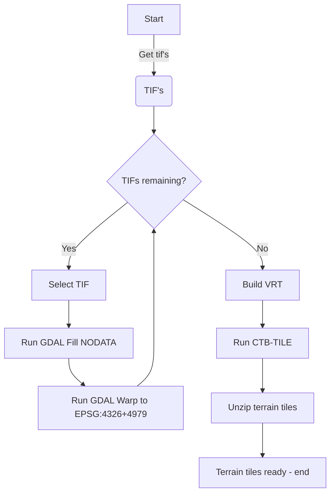

# terrain

Scripts for creating Cesium Quantized mesh terrain tiles

Quantized mesh specs: https://github.com/CesiumGS/quantized-mesh


## Input

- 0.5m DTM's from https://service.pdok.nl/rws/ahn/atom/index.xml

- 5M DTM's from [GeoJSON](https://services.arcgis.com/nSZVuSZjHpEZZbRo/arcgis/rest/services/Kaartbladen_AHN3/FeatureServer/0/query?where=1%3D1&objectIds=&time=&geometry=&geometryType=esriGeometryEnvelope&inSR=&spatialRel=esriSpatialRelIntersects&resultType=none&distance=0.0&units=esriSRUnit_Meter&relationParam=&returnGeodetic=false&outFields=*&returnGeometry=true&returnCentroid=false&featureEncoding=esriDefault&multipatchOption=xyFootprint&maxAllowableOffset=&geometryPrecision=&outSR=&defaultSR=&datumTransformation=&applyVCSProjection=false&returnIdsOnly=false&returnUniqueIdsOnly=false&returnCountOnly=false&returnExtentOnly=false&returnQueryGeometry=false&returnDistinctValues=false&cacheHint=false&orderByFields=&groupByFieldsForStatistics=&outStatistics=&having=&resultOffset=&resultRecordCount=&returnZ=false&returnM=false&returnExceededLimitFeatures=true&quantizationParameters=&sqlFormat=none&f=pgeojson&token=)

## Samples

Utrechtse Heuvelrug

https://geodan.github.io/terrain/samples/heuvelrug/


## Docker

The Docker image contains:

- ctb-tile

- GDAL

- GDAL python tooling

- shell scripts for processing tifs to terrain tiles

Todo: Add a shell script to Docker image

### Building

```
$ docker build -t terrain_tiler .
```

### Running

```
$ docker run -it terrain-tiler hello
Terrain tiler 0.1
Startup parameters: hello
Current directory: /data
Tif files available:
ls: cannot access '*.tif': No such file or directory```
```

Use a volume mount to process tifs on host:

```
$ docker run -v D:/geodata/tifs:/data -it terrain-tiler hello
```

Script process.sh is run as entrypoint

gdal_fillnodata can run by:

```
$ python /usr/local/bin/gdal_fillnodata.py
```

## Scripts

Run scripts from 'scripts' folder. 

Prerequisites:

- wget installed

- Docker installed

- Gdal installed + Python GDAL tooling

```script
$ sh 0_download.sh
$ sh 1_create_tiles.sh
$ sh 2_unzip.sh
$ sh 3_cleanup.sh
```

## Process


