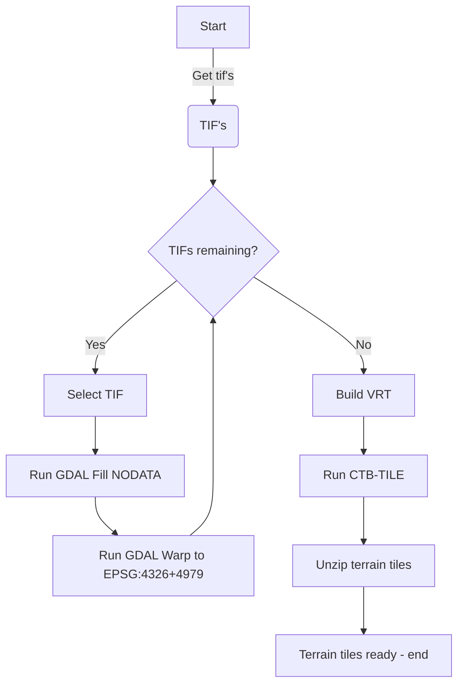

# terrain

Scripts for creating Cesium Quantized mesh terrain tiles

Quantized mesh specs: https://github.com/CesiumGS/quantized-mesh


Docker image: https://hub.docker.com/repository/docker/geodan/terraintiler

## Input

- 0.5m DTM's from https://service.pdok.nl/rws/ahn/atom/index.xml

- 5M DTM's from [GeoJSON](https://services.arcgis.com/nSZVuSZjHpEZZbRo/arcgis/rest/services/Kaartbladen_AHN3/FeatureServer/0/query?where=1%3D1&objectIds=&time=&geometry=&geometryType=esriGeometryEnvelope&inSR=&spatialRel=esriSpatialRelIntersects&resultType=none&distance=0.0&units=esriSRUnit_Meter&relationParam=&returnGeodetic=false&outFields=*&returnGeometry=true&returnCentroid=false&featureEncoding=esriDefault&multipatchOption=xyFootprint&maxAllowableOffset=&geometryPrecision=&outSR=&defaultSR=&datumTransformation=&applyVCSProjection=false&returnIdsOnly=false&returnUniqueIdsOnly=false&returnCountOnly=false&returnExtentOnly=false&returnQueryGeometry=false&returnDistinctValues=false&cacheHint=false&orderByFields=&groupByFieldsForStatistics=&outStatistics=&having=&resultOffset=&resultRecordCount=&returnZ=false&returnM=false&returnExceededLimitFeatures=true&quantizationParameters=&sqlFormat=none&f=pgeojson&token=)

## Samples

Utrechtse Heuvelrug

https://geodan.github.io/terrain/samples/heuvelrug/


## Getting started

Download AHN3 GeoTIFF and process to terrain tiles. 

```
$ wget https://ns_hwh.fundaments.nl/hwh-ahn/ahn4/02b_DTM_5m/M5_31GN2.zip
$ unzip M5_31GN2.zip
```

Tiling on Linux:

$ docker run -v $(pwd):/data geodan/terraintiler
```

Tiling on Windows: specify the path when running the Docker image:

```
$ docker run -v d:\data:/data -it geodan/terraintiler
```

A subfolder 'tiles' will be created containing  file layer json and a set of .terrain tiles in a directory per level (0-15).

## Docker

The Docker image contains:

- ctb-tile

- GDAL

- GDAL python tooling

- shell script for processing tifs to terrain tiles

## Building

```
$ docker build -t geodan/terraintiler .
```

## Running

Use a volume mount named 'data' in the docker image to process tif files on the host machine.

```
$ docker run -v [local_path_to_tiffs_dir]:/data -it geodan/terraintiler
```

The script takes as input parameters:

```
Syntax: [-s|e|h|o]
options:
o Output directory - default 'tiles'
s Start zoomlevel - default 15
e End zoomlevel - default 0
h Print this help
```

Sample running Docker image with parameters - generate tiles for level 10 - 0 using '-s 10':

```
$ docker run -v [local_path_to_tiffs_dir]:/data -it geodan/terraintiler -s 10
```

Sample output:

```
Terrain tiler 0.1
Startup parameters: -s
Current directory: /data
Start: Mon Jun 19 13:19:55 UTC 2023
Output directory: tiles
Tif extension: TIF
Start zoomlevel: 10
End zoomlevel: 0
Source SRS: EPSG:7415
tmp directory created.
Delete output directory...
tiles directory created.
Start gdal_fillnodata and gdalwarp on input files...
Processing file M5_30GZ1.TIF...
Building virtual raster tmp/ahn.vrt...
Running ctb-tile from 10 to level 9...
Creating layer.json file...
Creating GTiff tiles for level 9...
Create vrt for GTiff tiles on level 9...
Run ctb tile on level 8-0
Cleaning up...
Unzip terrain files...
End: Mon Jun 19 13:19:56 UTC 2023
Elapsed time: 1 seconds.
End of processing`
```

## Process


