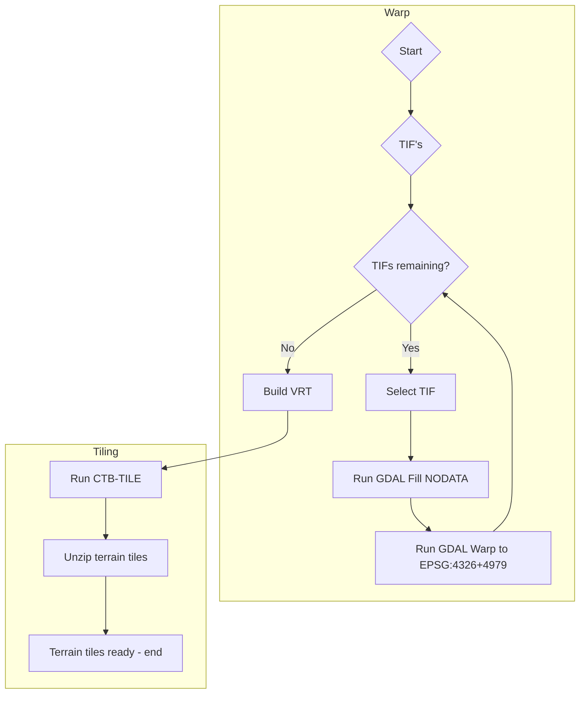

# terrain

Scripts for creating Cesium Quantized mesh terrain tiles

Quantized mesh specs: https://github.com/CesiumGS/quantized-mesh


## Live Samples

1] Maastricht - AHN4 https://geodan.github.io/terrain/samples/maastricht/

2] Maastricht - AHN4 with contours https://geodan.github.io/terrain/samples/maastricht/index-elevation.html


## Getting started

Download AHN4 0.5m GeoTIFF of Maastricht and process to terrain tiles. 

```
$ wget --no-check-certificate https://service.pdok.nl/rws/ahn/atom/downloads/dtm_05m/M_69AZ2.tif
```
Start processing input GeoTIFF's

```
$ docker run -it -v $(pwd):/data geodan/terrainwarp
```

A subfolder 'tmp' will be created containing the processed GeoTIFF's

```
$ docker run -v $(pwd):/data geodan/terraintiler
```

A subfolder 'tiles' will be created containing  file layer json and a set of .terrain tiles in a directory per level (0-15).

Terrain tiles can be used in CesiumJS as follows:

```javascript
var terrainProvider = new Cesium.CesiumTerrainProvider({
    url : './tiles'
});
viewer.scene.terrainProvider = terrainProvider;
viewer.scene.globe.depthTestAgainstTerrain=true;
```
Download sample client and start webserver:

```
$ wget https://raw.githubusercontent.com/Geodan/terrain/main/samples/maastricht/index.html
$ python -m http.server
```

Open browser on port 8000.

Result:


Live demo see https://geodan.github.io/terrain/samples/maastricht/

## Process



## Reference Systems

By default the reference system of the first input image used. If it's a Duch projection (epsg:28992) the vertical is also specified (using epsg: 7415 - composite of EPSG:28992 and EPSG:5709). The used epsg code can be overwritten with the -c in geodan/terrainwarp command.

In the process the images are warped using gdalwarp to EPSG:4326+4979 (-t_srs) to be used in Cesium using the WGS84 ellipsoid model.

## Docker

There are 2 Docker images:

1] Warp

The Warp Docker image contains a recent version of GDAL (3.7) and shell script for processing (gdal_fillnodata, gdalwarp, gdalbuildvrt).

See https://hub.docker.com/repository/docker/geodan/terrainwarp

2] Tiler

The Tiler Docker image contains:

- ctb-tile (https://github.com/geo-data/cesium-terrain-builder)

- Shell script for processing tifs to terrain tiles

See https://hub.docker.com/repository/docker/geodan/terraintiler

## Running

1] Warp

Use a volume mount named 'data' in the docker image to process tif files on the host machine.

```
$ docker run -v $(pwd):/data -it geodan/terrainwarp
```

The script takes as input parameters:

```
Syntax: [-c|m|h]
options:
c Source s_srs - default EPSG:7415
m fillnodata maxdistance (in pixels) - default 100
h Print this help
```

When option -c is not used, warp will check the EPSG code of the first GeoTIFF.

- If no EPSG code is detected or the EPSG code is 28992: the default s_srs is used (EPSG:7415). 
EPSG:7415 is a composite of EPSG:28992 (horizontal) and EPSG:5709 (vertical) used in the Netherlands. 
A the vertical EPSG code is optional but needed to transform from geoid to ellipsoid.
- In other cases: the detected EPSG code is used as s_srs

Sample output:

```
Terrain tiler 0.3.3 - Warp
Start: Tue Jul 25 12:52:27 UTC 2023
Temp directory: tmp
s_src input images:
Fillnodata maxdistance: 100
Delete tmp directory...
tmp directory created.
s_srs not set, trying to detect it from first GeoTIFF
EPSG of first tif: EPSG:28992
make s_srs epsg:7415 in case of epsg:28992
used s_srs: EPSG:7415
Start processing 1 GeoTIFFS...
100% 1:0=0s ./M5_32CN2.TIF
Building virtual raster tmp/ahn.vrt...
0...10...20...30...40...50...60...70...80...90...100 - done.
VRT created: tmp/ahn.vrt
End: Tue Jul 25 12:52:28 UTC 2023
Elapsed time: 1 seconds.
End of processing
```

2] Tiler

Running: 

```
$ docker run -v $(pwd):/data -it geodan/terraintiler
```

```
Syntax: [-s|b|e|o|h]
options:
o Output directory - default tiles
b Break zoomlevel - default 9
s Start zoomlevel - default 15
e End zoomlevel - default 0
h Print this help
```

Sample running Docker image with parameters - generate tiles for level 10 - 0 using '-s 10':

```
$ docker run -v $(pwd):/data -it geodan/terraintiler -s 10
```

Sample output:

```
Terrain tiler 0.3
Start: Wed Jun 21 09:24:39 UTC 2023
Output directory: tiles
Tif extension: TIF
Start zoomlevel: 15
Break zoomlevel: 9
End zoomlevel: 0
Delete output directory...
Directory created: tiles
Running ctb-tile from 15 to level 9...
Creating layer.json file...
Creating GTiff tiles for level 9...
Create vrt for GTiff tiles on level 9...
Run ctb tile on level 8 to 0
Cleaning up...
Unzip terrain files...
End: Wed Jun 21 09:24:45 UTC 2023
Elapsed time: 6 seconds.
End of processing
```

## Known issues

In the tiling process, the following errors can occur:

```
ERROR 1: Integer overflow : nSrcXSize=97201, nSrcYSize=18001
ERROR 1: IReadBlock failed at X offset 0, Y offset 0
ERROR 1: GetBlockRef failed at X block offset 0, Y block offset 0 Error: Could not read heights from raster #74
```

See also https://github.com/geo-data/cesium-terrain-builder/issues/37

Fix: Increase the -b option to a higher level

## Building

Warp Docker image:

```
$ docker build -t geodan/terrainwarp .
```

Tiler Docker image:

```
$ docker build -t geodan/terraintiler .
```

To build the images together use:

```
$ sh build_all.sh
```

## History

2023-07-24: release 0.3.3: bug fix warp 

2023-07-20: release 0.3.2: give more feedback on progress

2023-07-17: release 0.3.1 - add -m option in warp for gdal_fillnodata max_distance

2023-07-06: release 0.3 - split process in tiler and warp  
