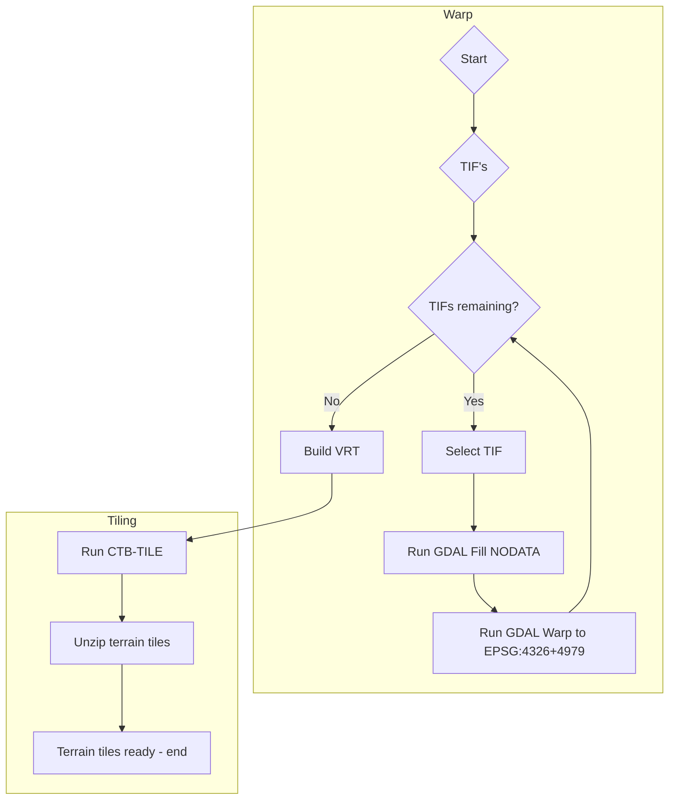

# terrain

Scripts for creating Cesium Quantized mesh terrain tiles

Quantized mesh specs: https://github.com/CesiumGS/quantized-mesh


## Live Samples

1] Heuvelrug - AHN3 https://geodan.github.io/terrain/samples/heuvelrug/

2] Maastricht - AHN4 https://geodan.github.io/terrain/samples/maastricht/


3] Maastricht - AHN4 with contours https://geodan.github.io/terrain/samples/maastricht/index-elevation.html


## Getting started

Download AHN3 5M GeoTIFF of Utrechtse Heuvelrug and process to terrain tiles. 


```
$ wget --no-check-certificate https://ns_hwh.fundaments.nl/hwh-ahn/AHN3/DTM_5m/M5_32CN2.zip
$ unzip M5_32CN2.zip
```


Tiling on Linux:

```
$ docker run -v $(pwd):/data geodan/terrainwarp
$ docker run -v $(pwd):/data geodan/terraintiler
```

Remember for tiling on Windows fully specify the volume path.

A subfolder 'tiles' will be created containing  file layer json and a set of .terrain tiles in a directory per level (0-15).


Terrain tiles can be used in CesiumJS as follows:

```javascript
var terrainProvider = new Cesium.CesiumTerrainProvider({
    url : './tiles'
});
viewer.scene.terrainProvider = terrainProvider;
viewer.scene.globe.depthTestAgainstTerrain=true;
```

Download sample client and start webserver:

```
$ wget https://raw.githubusercontent.com/Geodan/terrain/main/samples/heuvelrug/index.html
$ python -m http.server
```

Open browser on port 8000.

Result:


Live demo see https://geodan.github.io/terrain/samples/heuvelrug/

Sample content of terrain tile at level 15:

[samples/heuvelrug/heuvelrug_15_33730_25874.geojson](samples/heuvelrug/heuvelrug_15_33730_25874.geojson)


## Input

- 0.5m DTM's from https://service.pdok.nl/rws/ahn/atom/index.xml

- 5M DTM's from [GeoJSON](https://services.arcgis.com/nSZVuSZjHpEZZbRo/arcgis/rest/services/Kaartbladen_AHN3/FeatureServer/0/query?where=1%3D1&objectIds=&time=&geometry=&geometryType=esriGeometryEnvelope&inSR=&spatialRel=esriSpatialRelIntersects&resultType=none&distance=0.0&units=esriSRUnit_Meter&relationParam=&returnGeodetic=false&outFields=*&returnGeometry=true&returnCentroid=false&featureEncoding=esriDefault&multipatchOption=xyFootprint&maxAllowableOffset=&geometryPrecision=&outSR=&defaultSR=&datumTransformation=&applyVCSProjection=false&returnIdsOnly=false&returnUniqueIdsOnly=false&returnCountOnly=false&returnExtentOnly=false&returnQueryGeometry=false&returnDistinctValues=false&cacheHint=false&orderByFields=&groupByFieldsForStatistics=&outStatistics=&having=&resultOffset=&resultRecordCount=&returnZ=false&returnM=false&returnExceededLimitFeatures=true&quantizationParameters=&sqlFormat=none&f=pgeojson&token=)

## Process



## Reference Systems

By default the composite Dutch reference system for the input GeoTIFFS is assumed (s_srs epsg: 7415). This can be changed with option -c in geodan/terrainwarp command.

EPSG:7415 is a composite of:

```
Horizontal Reference System	EPSG:28992
Vertical Reference System	EPSG:5709
```
In the process the images are warped using gdalwarp to EPSG:4326+4979 (-t_srs) to be used in Cesium using the WGS84 ellipsoid model.

## Docker

There are 2 Docker images:

1] Warp

The Warp Docker image contains a recent version of GDAL (3.7) and shell script for processing (gdal_fillnodata, gdalwarp, gdalbuildvrt).

See https://hub.docker.com/repository/docker/geodan/terrainwarp

2] Tiler

The Tiler Docker image contains:

- ctb-tile (https://github.com/geo-data/cesium-terrain-builder)

- Shell script for processing tifs to terrain tiles

See https://hub.docker.com/repository/docker/geodan/terraintiler

## Running

1] Warp

Use a volume mount named 'data' in the docker image to process tif files on the host machine.

```
$ docker run -v $(pwd):/data -it geodan/terrainwarp
```

The script takes as input parameters:

```
Syntax: [-c|m|h]
options:
c Source s_srs - default EPSG:7415
m fillnodata maxdistance (in pixels) - default 100
h Print this help
```

Sample output:

```
Terrain tiler 0.3 - Warp
Start: Wed Jul 5 12:06:39 UTC 2023
Temp directory: tmp
Source SRS: EPSG:7415
Fillnodata maxdistance: 100
tmp directory created.
Start processing 256 GeoTIFFS...
Processing DSM_1627_3855...
Building virtual raster tmp/ahn.vrt...
VRT created: tmp/ahn.vrt
End: Wed Jul 5 12:13:33 UTC 2023
Elapsed time: 414 seconds.
End of processing
```

2] Tiler

Running: 

```
$ docker run -v $(pwd):/data -it geodan/terraintiler
```

```
Syntax: [-s|b|e|o|h]
options:
o Output directory - default tiles
b Break zoomlevel - default 9
s Start zoomlevel - default 15
e End zoomlevel - default 0
h Print this help
```

Sample running Docker image with parameters - generate tiles for level 10 - 0 using '-s 10':

```
$ docker run -v $(pwd):/data -it geodan/terraintiler -s 10
```

Sample output:

```
Terrain tiler 0.3
Start: Wed Jun 21 09:24:39 UTC 2023
Output directory: tiles
Tif extension: TIF
Start zoomlevel: 15
Break zoomlevel: 9
End zoomlevel: 0
Delete output directory...
Directory created: tiles
Running ctb-tile from 15 to level 9...
Creating layer.json file...
Creating GTiff tiles for level 9...
Create vrt for GTiff tiles on level 9...
Run ctb tile on level 8 to 0
Cleaning up...
Unzip terrain files...
End: Wed Jun 21 09:24:45 UTC 2023
Elapsed time: 6 seconds.
End of processing
```

## Known issues

In the tiling process, the following errors can occur:

```
ERROR 1: Integer overflow : nSrcXSize=97201, nSrcYSize=18001
ERROR 1: IReadBlock failed at X offset 0, Y offset 0
ERROR 1: GetBlockRef failed at X block offset 0, Y block offset 0 Error: Could not read heights from raster #74
```

See also https://github.com/geo-data/cesium-terrain-builder/issues/37

Fix: Increase the -b option to a higher level

## Building

Warp Docker image:

```
$ docker build -t geodan/terrainwarp .
```

Tiler Docker image:

```
$ docker build -t geodan/terraintiler .
```

To build the images together use:

```
$ sh build_all.sh
```

## History

2023-07-24: release 0.3.3: bug fix warp 

2023-07-20: release 0.3.2: give more feedback on progress

2023-07-17: release 0.3.1 - add -m option in warp for gdal_fillnodata max_distance

2023-07-06: release 0.3 - split process in tiler and warp  
