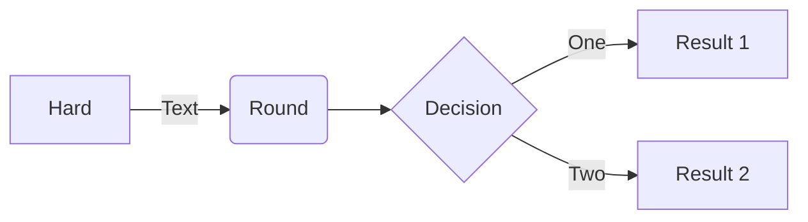

# terrain

Scripts for creating Cesium Quantized mesh terrain tiles

Quantized mesh specs: https://github.com/CesiumGS/quantized-mesh

## Input

0.5m DTM's from https://service.pdok.nl/rws/ahn/atom/index.xml

## Samples

Utrechtse Heuvelrug

https://geodan.github.io/terrain/samples/heuvelrug/


## Running

Run scripts from 'scripts' folder. 

Prerequisites:

- wget installed

- Docker installed

- Gdal installed + Python GDAL tooling

```script
$ sh 0_download.sh
$ sh 1_create_tiles.sh
$ sh 2_unzip.sh
$ sh 3_cleanup.sh
```

## Process




